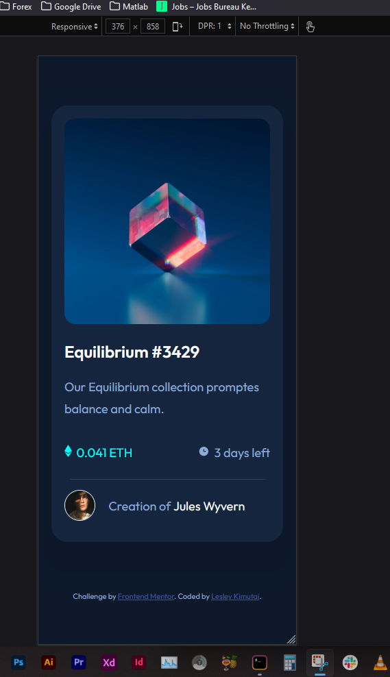
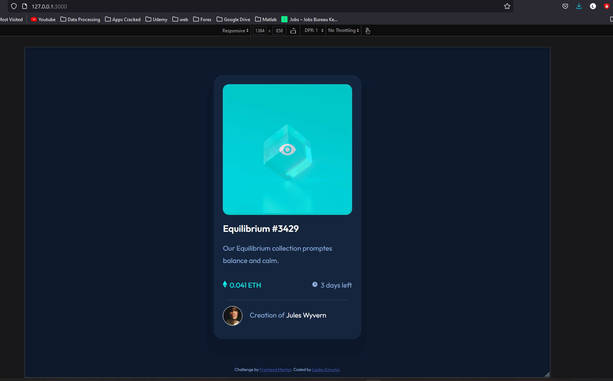

# Frontend Mentor - NFT preview card component solution

This is a solution to the [NFT preview card component challenge on Frontend Mentor](https://www.frontendmentor.io/challenges/nft-preview-card-component-SbdUL_w0U). Frontend Mentor challenges help you improve your coding skills by building realistic projects.

## Table of contents

- [Overview](#overview)
  - [The challenge](#the-challenge)
  - [Screenshot](#screenshot)
  - [Links](#links)
- [My process](#my-process)
  - [Built with](#built-with)
  - [What I learned](#what-i-learned)
- [Author](#author)
- [Acknowledgments](#acknowledgments)


## Overview

### The challenge

Users should be able to:

- View the optimal layout depending on their device's screen size
- See hover states for interactive elements

### Screenshot

#### Mobile Design :-



Mobile design

#### Laptop Design :-

Looks like this on the hover state of the image on a laptop feel😎



### Links

- Solution URL: [My Solution](https://github.com/issagoodlifeInc/ntf-card.git)
- Live Site URL: [Github Site](https://github.com/issagoodlifeinc.github.io/ntf-card/)

## My process

### Built with

- Semantic HTML5 markup
- CSS custom properties
- Flexbox
For the two lower divs to get the outcome required
- Mobile-first workflow
Yeah and probably the only way that works with cards too

### What I learned

The hover state of the box image was a nice addition ...
Had to link the view image with css to get the required outcome
Still didn't get the required blend even after trying to play around with the z-index thoug ...that was a bummer😒


```html

<div class="card-img">
  
  <div class="view"></div>
</div>

```

```css

.card-img .view:hover {
  background-color: var(--cyan);
  background-image: url("../images/icon-view.svg");
  background-repeat: no-repeat;
  background-position: center;
  z-index: 1;
  opacity: 0.75;
}

```

## Author

- Website - [Lesley Kimutai](https://leskimfamily.herokuapp.com/lesley)
- Frontend Mentor - [Leskim](https://www.frontendmentor.io/profile/yourusername)


## Acknowledgments

@KibiTheGreat - Moral support 😅💯
